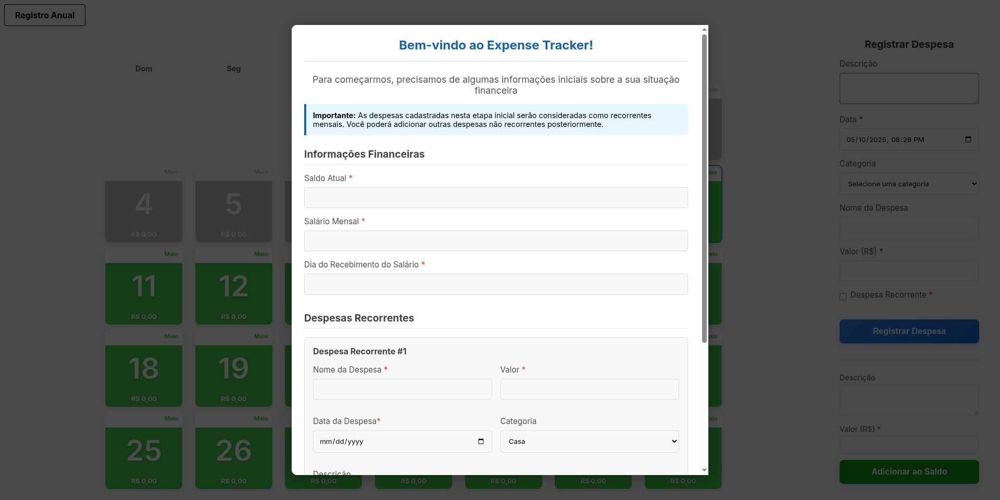
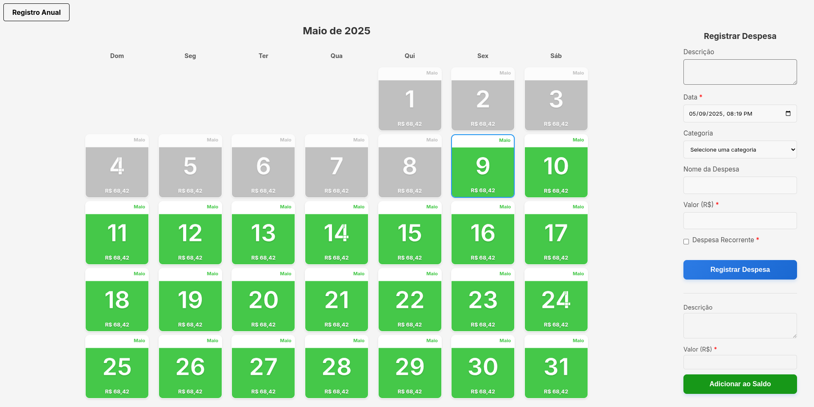
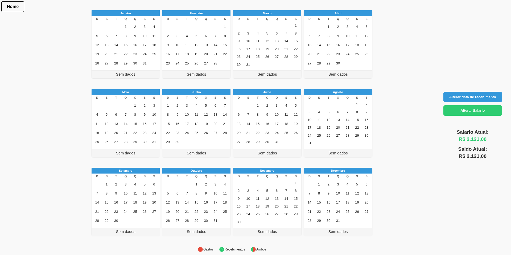

# 💸 Expense Tracker

Este é um sistema de controle de despesas pessoais desenvolvido com Java 21 e Spring Boot 3.4.5, utilizando PostgreSQL como banco de dados e JWT para autenticação. O projeto também conta com testes unitários e de integração utilizando Mockito, MockMvc e JUnit 5.
O projeto também conta com **monitoramento via Prometheus e Grafana**, além de uma **interface web construída com: HTML, CSS, Javascript & Thymeleaf**.

---

## 1. Visão Geral
Expense Tracker permite:

Cadastro de usuários com autenticação segura, com implementação de roles.

Registro e gerenciamento de despesas com categorias customizáveis

Controle de saldo e salário com cálculos automáticos de porcentagem gasta

Visualização analítica via interface web

Monitoramento de métricas de performance com Prometheus e Grafana para admins.

---

## 🔧 Tecnologias Utilizadas e Escolhas Técnicas

#### 2.1 Linguagem e Framework:
- ✅ Java 21: Otimizações de performance e suporte a longo prazo.
- ✅ Spring Boot 3.4.5: Versão mais recente do Spring, com auto configuração já muito completa, integração nativa com Security, Data JPA e Actuator.
#### 2.2 Segurança 
- ✅ JWT stateless: Não armazena sessão no servidor, economizando recursos facilitando escalabilidade horizontal, armazenado em cookie Http-only, para mitigar XSS, validado a cada requisição feita.
- ✅ Bcrypt: Escolha robusta, com hashing dinâmico que dificulta ataques de força bruta, sem grandes impactos na performance.
#### 2.3 Persistência de Dados
- ✅ PostgreSQL: Escolha muito utilizada em função de ser open source e gratuita, apesar de ter algumas especificidades que possam garantir o motivo da escolha.
- ✅ Spring Data JPA: Minha escolha favorita quando se trata de persistência, garante forte legibilidade, facilita acesso ao banco de dados e simplifica operações CRUD por abstração, as queries nativas evitam SQL Injection, além da possibilidade de criar consultas mais complexas, como fetch joins.
#### 2.4 Front-end e Templates
- ✅ Thymeleaf: Templates gerados via SSR, possibilita alinhar o front-end com a lógica desejada no back-end, entregando ao usuário final funcionalidades específicas por exemplo, é ótimo para SEO e evita XSS.
#### 2.5 Containerização e DevOps
- ✅ Docker Compose: Facilita imensamente o deploy, ao mesmo tempo que garante boa performance, isolamento entre serviços (app e banco), garantindo consistência, apesar de não ser recomendado utilizar bancos de dados dentro de contâiners.
- ✅ Micrometer + Prometheus + Grafana: métricas de latência, uso de memória e throughput; dashboards prontos para diagnosticar gargalos.
#### 2.6 Testes
- ✅ JUnit5 + Mockito: cobertura de lógica de negócio via testes unitários com mocks.
- ✅MockMvc: testes de integração de endpoints REST, validando o contexto completo da aplicação, códigos HTTP e payload JSON.

#### 3. Arquitetura e Padrões

##### Aplicação estruturada em quatro camadas:

- ✅ Controller: mapeamento de endpoints REST.

- ✅ Service: regras de negócio, gerenciamento de transações e tratamento de exceções globais via @ControllerAdvice.

- ✅ Repository: interfaces Spring Data com queries customizadas em JPQL quando necessário.

- ✅ Modelos e DTOs: Separação entre entidades de persistência de objetos de transporte, garantindo código limpo, segurança e evitando enviar dados desnecessários.

---
## 📦 Funcionalidades

- Cadastro e login de usuários com autenticação via JWT
- Criação, edição e exclusão de despesas
- Categorias de despesas
- Listagem de todas as despesas por usuário
- Interface web com Thymeleaf
- Monitoramento de métricas com Prometheus
- Dashboard com Grafana

---
## 📸 Capturas de Tela

### Primeiro Login condicional com Thymeleaf:


### Dashboard de despesas:


### Overview Anual:


---

## 🚀 Como executar o projeto

É necessário ter o ** **Docker** e **Docker Compose** instalados.

### 1. Clone o repositório:

```bash
 git clone https://github.com/RafaelMelo23/expensetracker.git
 cd expense-tracker
```

### 2. Inicie os containers:

```bash
 docker-compose up --build
```

### 4. Acesse a aplicação:

- Web App: [http://localhost:8080](http://localhost:8080)
- Grafana: [http://localhost:3000](http://localhost:3000)  
  *(usuário padrão: `admin` / senha: `admin`)*

---

## ⚙️ Endpoints da API (Simplificado)

- `POST /auth/register`: cadastro de novo usuário
- `POST /auth/login`: autenticação (retorna JWT)
- `GET /expenses`: lista de despesas do usuário autenticado
- `POST /expenses`: criar nova despesa
- `PUT /expenses/{id}`: atualizar despesa
- `DELETE /expenses/{id}`: deletar despesa

---

## 📊 Monitoramento

O projeto expõe métricas no endpoint /actuator/prometheus, que são consumidas pelo Prometheus, que é protegido pela autenticação JWT, periodicamente substituindo seu próprio token. Você pode acompanhar o uso do sistema via dashboards no Grafana.

---

## 📦 API REST - Controllers

A aplicação segue uma arquitetura RESTful e está dividida em controllers responsáveis por diferentes domínios do sistema:

### 🔐 `UserController` (`/api/user`)
Gerencia autenticação e dados financeiros do usuário:

- `POST /register`: Registro de novos usuários
- `POST /login`: Autenticação com JWT via cookie `HttpOnly`
- `GET /get/balance`: Retorna o saldo atual do usuário
- `GET /get/salary`: Retorna o valor do salário atual
- `GET /get/salary/spent`: Retorna a porcentagem do salário já utilizada

### 💰 `AdditionsController` (`/api/additions`)
Responsável por operações relacionadas a adições de valores:

- `GET /get/yearly?year=2024`: Lista todas as adições do ano informado
- `POST /add/balance`: Adiciona um valor ao saldo atual
- `PUT /salary/update`: Atualiza o valor do salário
- `PUT /salary/date/update`: Atualiza o dia do mês em que o salário é recebido

### 🧾 `ExpenseController` (`/api/expense`)
Gerencia o registro e listagem de despesas:

- `POST /first/registry`: Registro inicial de despesas após o cadastro
- `POST /register`: Adiciona uma nova despesa
- `GET /get/all`: Lista todas as despesas
- `GET /get/all/v2`: Lista despesas agrupadas por mês  
